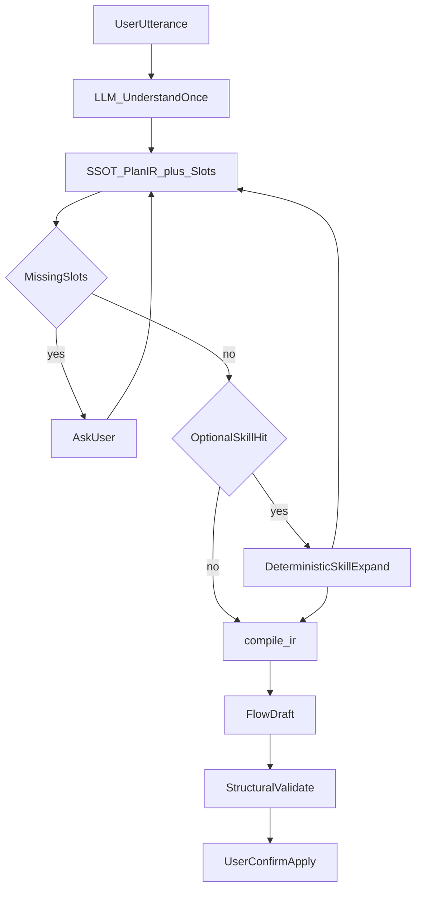

# Flow AI：唯一真相（SSOT）架构与演进计划

更新日期：2026-07-26  
状态：方向决议（待按阶段落地）  
关联：[`FLOW_AI_LANGGRAPH.md`](./FLOW_AI_LANGGRAPH.md)、[`FLOW_AI_TECHNICAL_PLAN.md`](./FLOW_AI_TECHNICAL_PLAN.md)

---

## 1. 产品原则（不可妥协）

1. **通用能力是底盘**  
   没有 Skill 时，Agent 仍须能完成一般桌面自动化任务（激活窗口、OCR 点击、输入、按键、等待、简单分支等）。表现力以「通用 PlanIR + 确定性编译」做到最好；允许不完美，但不允许经常性假失败/空草稿。

2. **Skill 是锦上添花**  
   Skill 可选。命中时用作者（或用户）写好的模板提升稳定性与完成度；未命中时不得阻塞通用路径。Agent **不得**退化成「纯靠 Skill 才能干活」。

3. **Skill 可可视化管理**  
   用户通过界面增删改查、启用/禁用、保存 Skill；不是只能改仓库内 JSON。

4. **唯一真相（SSOT）**  
   整个编排链路只认一份可执行任务描述。禁止多份语义并行权威、禁止 LLM 用一份输出去审判另一份输出。

---

## 2. 问题诊断（为何总修不完）

### 2.1 根因

当前主路径近似：

```
话术 → UnderstandIR(goals+slots) → PlanIR → Flow 草稿
              ↑ 审判 ↓
         gap / coverage / repair
```

同一任务被描述了三遍，且 **goals 与 PlanIR 都由 LLM 生成**，再用 goals 检查 PlanIR，形成「LLM 检查 LLM、LLM 修复 LLM」。任一层格式漂移（字符串 goals、`a` 写成字符串、积木名当 opcode、空 goals）都会被放大为重规划、假 capability_gap、`validation_failed`。

这不是 Prompt 不够好，而是 **缺少 SSOT + 职责边界混乱**。

### 2.2 近期日志佐证（摘要）

| 现象 | 实质 |
| ---- | ---- |
| goals 字符串 / 占位字段导致理解回退 | 契约过脆，整段清空 |
| `window_activate` 被当成「不支持」 | 积木名未归一到 IR op，假缺口 |
| 一个 OCR 点击拆成两个 goals → 覆盖失败 | goals 粒度与 PlanIR 不一致，且 goals 有审判权 |
| PlanIR/`a` 为字符串 → 大纲整段失败 | 结构化输出过脆 |
| 空 goals 但 PlanIR 已可用 → 仍报「缺少任务目标」 | 用派生契约惩罚 SSOT 候选 |
| 草稿追加 7→15 节点 | 会话复用草稿无重置 |

### 2.3 已做的加固（过渡层，非终局）

以下改动减轻症状，**不能替代 SSOT 换轨**：

- UnderstandIR：字符串 goals 升格、占位 goals 清洗、`capability_gap` 空义归一  
- `required_ops` 别名归一（`window_activate→activate` 等）、空 ops 轻量推断  
- 连续同 op goals 可共享一步 IR；coverage 契约问题降为 soft warning  
- validate 分层：结构硬错误 vs 契约软警告；repair 不空转修契约  
- 重规划重置草稿节点，避免追加重复链  
- Prompt 收紧（IR 闭集、ocr_click 原子、禁止伪引用）

终局仍须：**砍掉「goals 权威审判 PlanIR」**，让通用 PlanIR（+slots）成为唯一可执行真相。

---

## 3. 目标架构

### 3.1 一句话

**LLM 只负责理解任务；代码负责规划展开、编译、校验与修复。全链路只有一份可执行 IR（SSOT）。Skill 可选地优化这份 IR，永不取代通用底盘。**

### 3.2 职责边界

| 角色 | 负责 | 不负责 |
| ---- | ---- | ------ |
| LLM | 从话术抽出 slots / missing；产出（或修订）**一份** PlanIR；可选建议 `skill_id` | 生成第二套 goals 去审 PlanIR；直接堆积木 JSON；用 tool 环「修契约」 |
| 确定性代码 | 宽松解析 IR、缺参澄清文案、Skill 模板展开、`compile_ir`、结构校验、入口修补、草稿重置 | 再调 LLM 互相检查 |
| Skill（可选） | 用可视化编辑的模板，把 slots 展开成更稳的 PlanIR 片段/全量 | 作为唯一执行路径；阻断通用 IR |
| 用户 | 确认应用到画布；在 UI 管理 Skill | — |

### 3.3 SSOT 定义

**唯一真相 = `PlanIR` + 规范化 `slots`。**

```text
PlanIR.steps[{ op, a }]   // 闭集 opcode + 短参数
slots{ window_title, contact, message, ... }
```

规则：

- 所有模块（gap、compile、validate、UI 大纲预览）只读这一份。  
- **goals / task_contract 若保留**：只能从 PlanIR（+slots）**派生**，用于展示或日志，**不得**作为 coverage 硬门槛反审 PlanIR。  
- Flow 草稿是 SSOT 的**编译产物**，不是第二份任务语义；重规划时重建草稿，不与旧草稿语义并行权威。

### 3.4 目标主流程

```text
load_context
  → understand_or_plan   # 一次（或极少次）LLM：slots + PlanIR；可选 skill 建议
  → clarify?             # 仅缺槽时；答完写回同一 slots / 补全同一 PlanIR
  → maybe_apply_skill    # 代码：若用户启用且命中 skill → 模板展开覆盖/精修 PlanIR
  → build_loop           # compile_ir → 草稿
  → validate             # 仅结构：入口、plan↔节点、裸坐标、坏引用
  → repair?              # 仅结构；代码优先补入口
  → summarize
  → 用户确认应用到画布
```

对比现状应删除或降级的环：

- 删除：**goals → 审判 PlanIR → 再 plan_outline** 的 LLM↔LLM 博弈  
- 降级：understand 与 plan 两次「重新理解世界」→ 合并为一次语义输出，或 understand 只抽槽、plan 只填同一 SSOT  
- repair：禁止因「未声明 required_ops / 缺少任务目标」进入工具环  



---

## 4. 通用能力做到最好（无 Skill）

### 4.1 能力范围（底盘必须覆盖）

闭集 op（与现 IR 对齐，可演进）：

`activate | ocr_click | type | key | wait | wait_text | schedule | find_image_click | color_click | loop | if_text | try_catch`

通用路径应稳定支持：

- 激活/切换窗口  
- 按屏幕文字点击（OCR 链）  
- 输入文本并提交（type + key）  
- 等待 / 等待文字  
- 简单循环与文字分支  
- 定时触发  

不要求通用路径一次就达到垂直场景（如微信）的产品级完美；要求 **可预测、可编译、少假失败**。

### 4.2 通用路径工程要点

1. **一次 LLM 出 SSOT**  
   结构化输出 schema 宽松：`a` 允许字符串并按 op 升格为对象；op 别名归一；失败时 salvage 部分 steps，禁止整段清空为 0 步（除非真无可解析内容）。

2. **缺参用澄清，不用重发明**  
   缺 `window` / `text` / `message` 等 → `missing` → UI 提问 → 写回 slots → 代码补全同一 PlanIR，而不是再生成另一套故事。

3. **编译确定性**  
   继续以 `compile_ir` → `outline_build` / recipes 为唯一落图主路径；坐标门禁 `strict_coords=True`；OCR → `{{ocr_id.x/y}}` 绑定。

4. **校验只对照 SSOT↔草稿**  
   - 硬错误：无入口、IR 步未生成对应节点、裸坐标、坏引用  
   - 软提示：模型自述不确定、可选优化建议（不阻断 `awaiting_confirm`）

5. **会话草稿策略**  
   非 clarify 恢复的新编排轮次：以空壳/base 重建后再编译，避免链追加重复。

6. **评测**  
   通用用例集（无 skill）：固定话术 → 期望 op 序列 / 关键类型序列；禁止依赖 goals 覆盖率作为唯一成功标准。

---

## 5. Skill：锦上添花 + 可视化 CRUD

### 5.1 定位

| | 通用 Agent | Skill |
| --- | --- | --- |
| 何时用 | 默认始终可用 | 用户启用且命中时 |
| 谁编写 | 模型 + 通用编译规则 | 用户/作者在 UI 中编辑 |
| 失败影响 | 直接决定底线体验 | 未命中则回退通用，不得拖垮整轮 |
| 输出 | PlanIR（SSOT） | 仍写入同一 PlanIR（替换或精修），不另建权威 |

### 5.2 运行时衔接（与 SSOT 兼容）

```text
若 skill 命中:
  PlanIR = expand_skill(skill, slots)   # 纯代码
否则:
  PlanIR = LLM 已产出的通用 PlanIR
compile_ir(PlanIR, slots) → draft
```

约束：

- Skill 展开结果必须是合法 PlanIR（或可投影为 PlanIR 的步骤表）。  
- 不允许 Skill 再开一条与 PlanIR 并行的「秘密流程描述」。  
- `call_skill` 若保留，应是 **展开 SSOT 的接口**，不是补洞阶段的第二规划器。

### 5.3 数据模型（建议）

用户 Skill 与内置包分离存储，例如：

- 内置只读：`backend/core/ai/skills/packs/*/skill.json`  
- 用户可写：`{data_dir}/ai/skills/{id}.json`（或等价目录）

最小字段：

```json
{
  "id": "wechat_send_message",
  "label": "微信发消息",
  "description": "打开微信并向联系人发送文本",
  "enabled": true,
  "triggers": ["微信", "发给", "发消息"],
  "params": [
    { "key": "contact", "label": "联系人", "required": true },
    { "key": "message", "label": "消息", "required": true },
    { "key": "window_title", "label": "窗口", "default": "微信" }
  ],
  "steps": [
    { "op": "activate", "a": { "window": "$window_title" } },
    { "op": "ocr_click", "a": { "text": "通讯录" } },
    { "op": "ocr_click", "a": { "text": "$contact" } },
    { "op": "type", "a": { "text": "$message" } },
    { "op": "key", "a": { "keys": "Enter" } }
  ]
}
```

说明：`steps` 与 PlanIR 同构，便于 SSOT 合并；`$slot` 由代码替换，不由 LLM 再写一遍。

### 5.4 可视化管理（产品要求）

界面能力（增删改查）：

| 能力 | 说明 |
| ---- | ---- |
| 列表 | 内置 / 用户 Skill；启用状态；触发词摘要 |
| 新建 | 从空白或「从当前草稿/PlanIR 另存为 Skill」 |
| 编辑 | 可视化编辑触发词、参数、步骤（op + 参数表）；预览展开结果 |
| 删除 | 用户 Skill 可删；内置可禁用不可删（或仅隐藏） |
| 启用/禁用 | 立即影响路由，无需改代码 |
| 导入/导出 | JSON 往返，便于备份与分享 |

Bridge API（建议）：

- `ai_skill_list` / `ai_skill_get`  
- `ai_skill_upsert` / `ai_skill_delete`  
- `ai_skill_set_enabled`  
- `ai_skill_preview_expand`（slots → PlanIR 预览）  
- `ai_skill_save_from_draft`（可选：从当前编排结果沉淀）

前端：独立「Skill 管理」页或设置子页；步骤编辑可复用积木/IR 选择器，不必先上完整画布 IDE。

---

## 6. 与现有模块的映射

| 现有模块 | 目标角色 |
| -------- | -------- |
| `session_manager.py` | 会话门面；新轮次草稿策略 |
| `flow_graph.py` | 缩短为「理解→澄清→（skill）→编译→结构校验」；去掉 goals 审判环 |
| `agent_ir.py` | PlanIR/slots 为 SSOT；goals 派生或移除权威；保留宽松 coerce |
| `ir_compile.py` / `outline_build.py` | 唯一落图引擎（通用底盘核心） |
| `skills/loader.py` + packs | 内置包 + 用户目录；`expand → PlanIR` |
| `lc/tools.py` `call_skill` | 可选；语义改为展开 SSOT |
| `lc/prompts.py` | 一次输出 SSOT；禁止要求模型维护平行 goals 契约 |
| 前端 Settings / 新 Skill 页 | 可视化 CRUD |

---

## 7. 分阶段落地

### 阶段 A — 稳住通用底盘（优先）

目标：无 Skill 时假失败显著下降，PlanIR 可用即交付。

- [x] PlanIR 结构化输出全面宽松解析（含 `a` 为字符串）  
- [x] goals/task_contract 退出硬校验；coverage 不再阻断 `awaiting_confirm`  
- [x] gap 只检查 SSOT 自身（缺参、空 steps），不检查「goals vs PlanIR」  
- [x] 禁止双权威：understand goals 非权威；plan 失败用槽位投影；派生 goals 仅展示  
- [x] 通用回归：`backend/test_agent_ir_guards.py`（含字符串 `a`、空 goals、oversplit goals）  

### 阶段 B — Skill 可选增强（运行时）

目标：命中 Skill 时更稳；未命中零影响。

- [ ] `expand_skill(skill, slots) -> PlanIR`  
- [ ] 路由：启用列表 + triggers/模型建议；失败回退通用 PlanIR  
- [ ] 用户 Skill 目录读写与内置只读分层  

### 阶段 C — Skill 可视化 CRUD

目标：非开发者可管理 Skill。

- [ ] Bridge API + 管理 UI（列表/编辑/启用/删除/预览）  
- [ ] 「从当前 PlanIR/草稿另存为 Skill」  
- [ ] 导入导出  

### 阶段 D — 清理与文档

- [ ] 删除或归档失效的 goals 审判路径与过时 prompt  
- [ ] 更新 `FLOW_AI_LANGGRAPH.md` 主路径描述与本文件互链  
- [ ] 明确 eval：通用用例不依赖 Skill；Skill 用例单独标记  

---

## 8. 成功标准

| 维度 | 标准 |
| ---- | ---- |
| 通用 | 无 Skill 时，典型「激活→点文字→输入→回车」类话术稳定产出可确认草稿；少出现契约类 `validation_failed` |
| SSOT | 一轮编排只有一份 PlanIR 权威；日志可指出「唯一 IR」而无 goals/Plan 互相矛盾 |
| Skill | 禁用全部 Skill 后通用仍可用；启用后仅增强命中任务 |
| 产品 | 用户可在 UI 完成 Skill 的增删改查与启用，无需改代码发版 |
| 可调试 | 失败时优先查：slots 是否齐、PlanIR 哪一步非法、编译哪一步失败——而不是三份描述对齐问题 |

---

## 9. 非目标

- 用 Skill 取代通用 Agent  
- 恢复「按应用场景的硬编码意图枚举」作为唯一路由（`intent_tag` 可继续废弃）  
- 无确认全自动点击生产默认开启  
- 让 LLM 在 repair 阶段再次生成完整任务语义  

---

## 10. 总结

| 要求 | 架构应答 |
| ---- | -------- |
| Agent 通用表现力最好 | PlanIR+slots 为 SSOT；一次理解、代码编译与结构校验；去掉 LLM↔LLM 审判 |
| Skill 锦上添花 | 可选展开同一份 PlanIR；未命中不影响底盘 |
| Skill 可视化可管理 | 用户目录 + Bridge CRUD + 管理 UI；步骤与 PlanIR 同构 |

**一句话：通用 PlanIR 是引擎，Skill 是可可视化管理的涡轮增压；全程只有一份任务真相，由代码执行，由 LLM 理解。**
